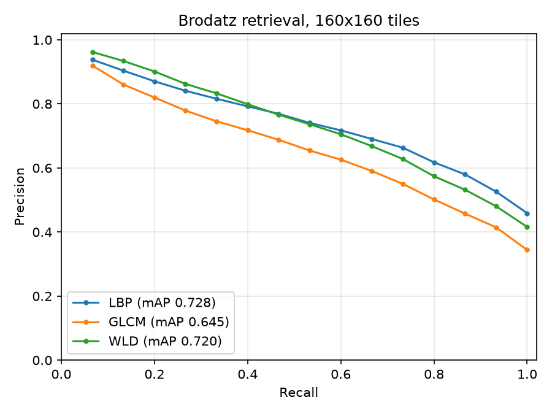

# multiprocessing-descriptors

Content-based texture retrieval on the [Brodatz album](https://www.ux.uis.no/~tranden/brodatz.html),
comparing three classic hand-crafted descriptors — **LBP**, **GLCM** and **WLD** — with feature
extraction spread across a process pool.

Originally written in 2018 for the Digital Image Processing course of the PPGCC graduate program;
revamped into a tested, installable package.



## How it works

1. **Dataset.** Each Brodatz texture (`D1.gif` ... `D112.gif`, 640x640 grayscale) is cut into
   non-overlapping `w x w` tiles. All tiles of a texture form one class.
2. **Descriptors.** Every tile is described independently, in parallel worker processes:

   | Descriptor | Dims | Definition |
   | --- | --- | --- |
   | LBP | 256 | Histogram of 3x3 local binary patterns (`neighbor >= center`) — Ojala et al., 1996 |
   | GLCM | 20 | Energy, entropy, contrast, homogeneity and correlation of symmetric co-occurrence matrices at 0°, 45°, 90°, 135° — Haralick et al., 1973 |
   | WLD | 960 | Joint histogram of differential excitation (M=6 segments x S=20 bins) and dominant orientation (T=8) — Chen et al., TPAMI 2010 |

   Histograms are normalized to sum to 1; GLCM features are z-scored per column because their
   scales differ.
3. **Retrieval.** Every tile queries all others, ranked by Euclidean distance. Precision is
   recorded each time a same-class tile is retrieved, giving one precision value per recall level.
   The report shows the mean curve, **mAP** (mean average precision) and **AUC-PR** (trapezoidal
   area under the mean curve).

## Quickstart

Requires Python 3.10+ and [uv](https://docs.astral.sh/uv/).

```bash
uv sync
uv run mpdescriptors download                 # ~36 MB into data/brodatz/
uv run mpdescriptors run --plot docs/pr_curves.png
```

Options for `run`:

| Flag | Default | Meaning |
| --- | --- | --- |
| `--descriptor` | `lbp glcm wld` | One or more descriptors to compare |
| `--window` | `160` | Tile size in pixels (must give at least 2 tiles per texture) |
| `--workers` | all CPUs | Worker processes; `1` runs serially |
| `--data-dir` | `data/brodatz` | Where the `D<n>.gif` files live |
| `--plot` | — | Save the precision-recall curves as a PNG |

## Results

111 textures x 16 tiles of 160x160 = 1776 queries (`D14.gif` is not available on the mirror):

| Descriptor | Dims | mAP | AUC-PR |
| --- | ---: | ---: | ---: |
| LBP | 256 | 0.728 | 0.744 |
| GLCM | 20 | 0.645 | 0.664 |
| WLD | 960 | 0.720 | 0.738 |

Chance level is about 1/111. With 320x320 tiles (4 per texture) the scores rise to
0.850 / 0.753 / 0.821 mAP, since larger tiles give more stable statistics.

## Development

```bash
uv run pytest        # GLCM is checked against scikit-image; LBP, WLD and the metrics against hand-computed cases
uv run ruff check .
```

```
src/mpdescriptors/
  cli.py          download / run commands
  dataset.py      image discovery, loading and tiling
  download.py     Brodatz downloader
  extraction.py   process-pool feature extraction
  evaluation.py   ranking, precision-recall, mAP, AUC-PR
  plotting.py     precision-recall curves
  descriptors/    lbp.py, glcm.py, wld.py
```

## License

[MIT](LICENSE)
